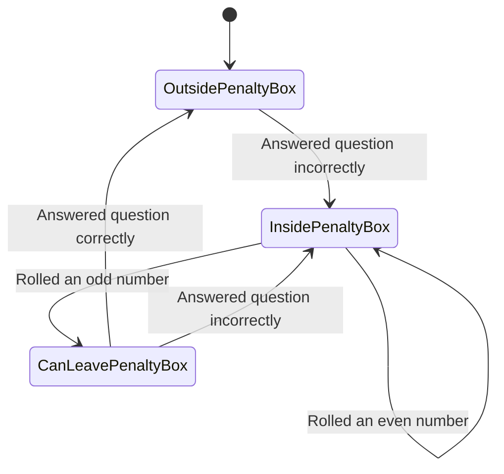

## Inbox
- Explore mutation testing with `mutant`;
- Trivia is poorly encapsulated;
- `puts "#{@players[@current_player]} was sent to the penalty box"`:
  - does not result in a diff in the golden master;
  - can add characters to this text, at the end, and the tests still pass (include may be too weak);
- ~~Quieten printing to standard out.~~
- Current player is implicit in the code and it is difficult, then, to set up the test correctly.
- ~~`was_correctly_answered` has duplicate code around answer was correct and award gold coins.~~
- ~~`roll` also has duplicate code.~~
- Why was `@in_penalty_box` instantiated with `nil` defaults?
- Could `@is_getting_out_of_penalty_box` be removed?
- Had to translate the Player being in the penalty box into the existing array `@in_penalty_box` because it is an array with `nil` default values.
## Penalty Box Diagram

