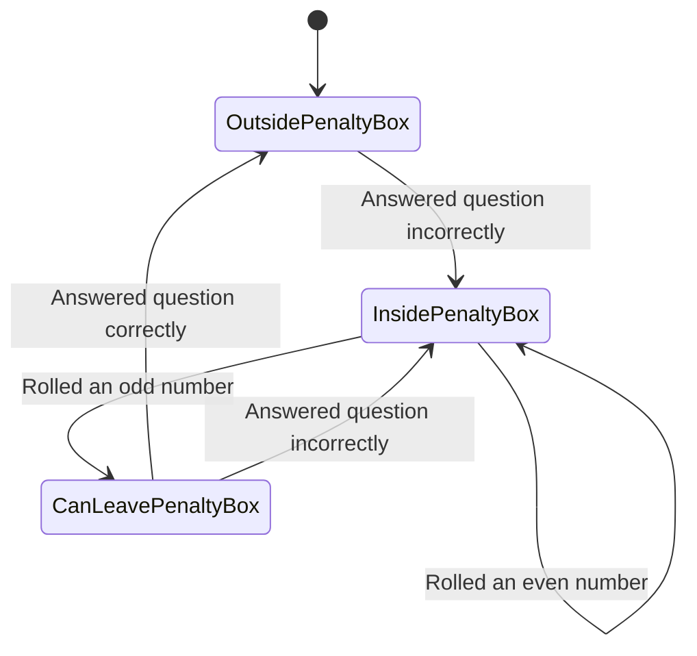

## Inbox
- Trivia is poorly encapsulated
- Quieten printing to standard out.
- Current player is implicit in the code and it is difficult, then, to set up the test correctly.

## Penalty Box Diagram

