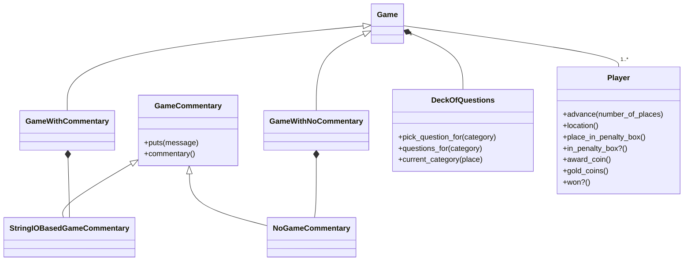

## Design that has emerged

```mermaid
classDiagram
    Game <|-- GameWithCommentary
    Game <|-- GameWithNoCommentary

    class GameCommentary {
        +puts(message)
        +commentary()
    }
    class StringIOBasedGameCommentary {
        
    }
    class NoGameCommentary {

    }

    class DeckOfQuestions {
        +pick_question_for(category)
        +questions_for(category)
        +current_category(place)
    }


    class Player {
        +advance(number_of_places)
        +location()
        +place_in_penalty_box()
        +in_penalty_box?()
        +award_coin()
        +gold_coins()
        +won?()
    }
Game *-- DeckOfQuestions
Game "1" -- "1..*" Player
GameCommentary <|-- StringIOBasedGameCommentary
GameCommentary <|-- NoGameCommentary    
GameWithCommentary *-- StringIOBasedGameCommentary  
GameWithNoCommentary *-- NoGameCommentary
```