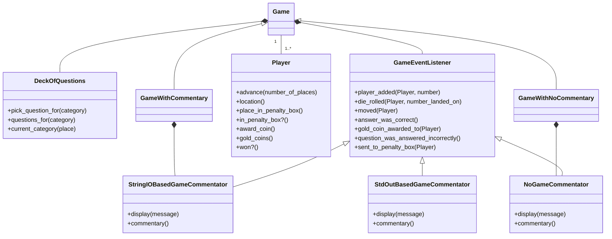

## Design that has emerged

```mermaid
classDiagram
    Game *-- DeckOfQuestions
    Game *-- GameEventListener
    Game "1" -- "1..*" Player

    class DeckOfQuestions {
        +pick_question_for(category)
        +questions_for(category)
        +current_category(place)
    }


    class Player {
        +advance(number_of_places)
        +location()
        +place_in_penalty_box()
        +in_penalty_box?()
        +award_coin()
        +gold_coins()
        +won?()
    }

    class GameEventListener {
        +player_added(Player, number)
        +die_rolled(Player, number_landed_on)
        +moved(Player)
        +answer_was_correct()
        +gold_coin_awarded_to(Player)
        +question_was_answered_incorrectly()
        +sent_to_penalty_box(Player)
    }

       Game <|-- GameWithCommentary
       Game <|-- GameWithNoCommentary


    class StringIOBasedGameCommentator {
        +display(message)
        +commentary()
    }
    class NoGameCommentator {
        +display(message)
        +commentary()
    }

    class StdOutBasedGameCommentator {
        +display(message)
        +commentary()
    }

GameEventListener <|-- StringIOBasedGameCommentator
GameEventListener <|-- NoGameCommentator
GameEventListener <|-- StdOutBasedGameCommentator
GameWithCommentary *-- StringIOBasedGameCommentator  
GameWithNoCommentary *-- NoGameCommentator
```